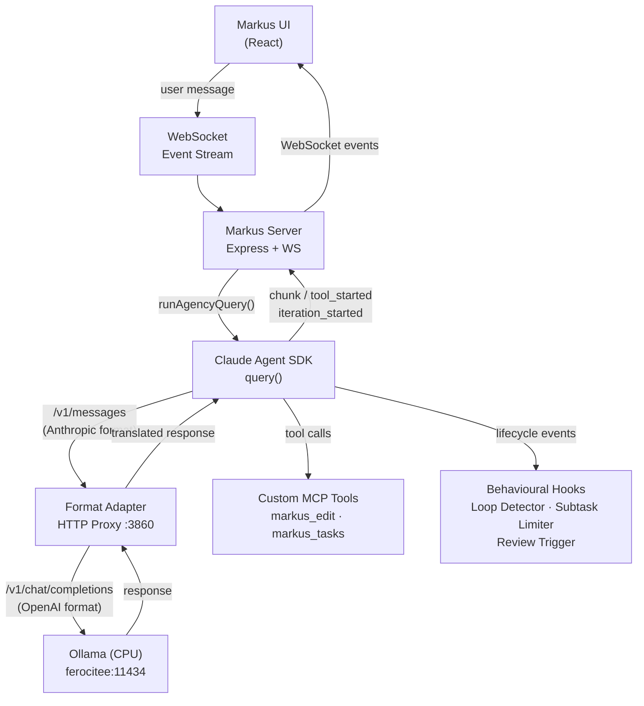
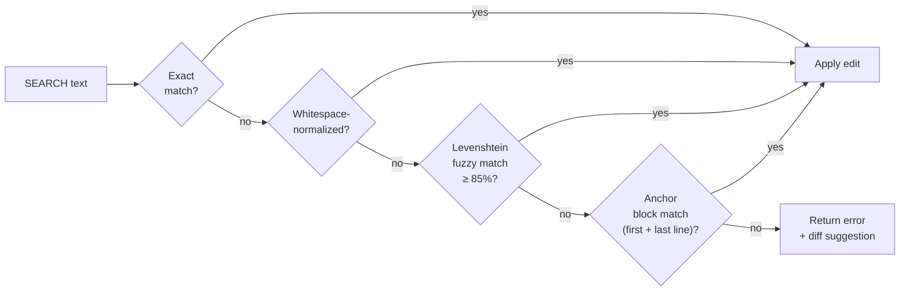
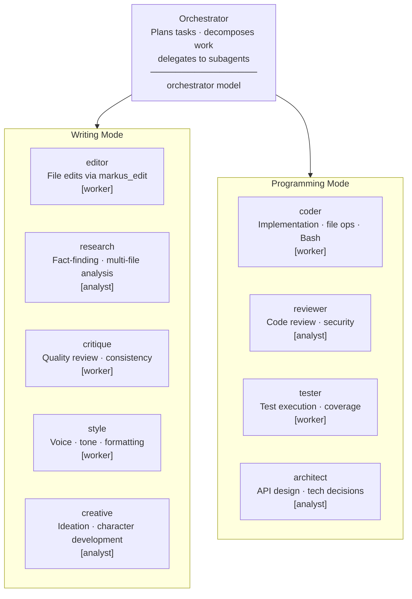

# Markus - WYSIWYG Markdown Editor

A local, cross-platform WYSIWYG markdown editor built with Electron, React, and ProseMirror.

> **Research Preview** — Markus is an experimental project that tests the *Markdown First* programming paradigm. It explores how well software can be written and managed using repositories where markdown is the primary medium, and how the accuracy of language models can be increased by using specialized sub-agents.

## Principles

1. **Clean, short context benefits all LLMs.** Both small local models and large state-of-the-art models produce better results when the context they operate on is well-structured and concise.
2. **Native markdown rendering is the key to successful project management.** When documents are rendered natively rather than treated as raw text, project planning, documentation, and collaboration become significantly more effective.
3. **Agency should be implemented as an API.** Agent capabilities are exposed through an HTTP/WebSocket API so that any GUI — including Markus — can consume them without coupling to a specific frontend.

## Features

- **WYSIWYG Editing**: Edit markdown visually with real-time formatting
- **Markdown Input Rules**: Type `# ` for headings, `- ` or `* ` for bullet lists, `1. ` for numbered lists, `> ` for blockquotes, ``` for code blocks
- **Keyboard Shortcuts**: `Ctrl+B` bold, `Ctrl+I` italic, `Ctrl+`` code, and more
- **Slash Commands**: Type `/` to access formatting options quickly
- **Split View**: Toggle markdown preview alongside the editor
- **File Operations**: Open, save, and create markdown files
- **Git Integration**: View git status, commit changes, pull/push from the editor
- **Command Palette**: Quick access to all commands via `Ctrl+P`
- **Themes**: Light, dark, and system theme support
- **Document Import**: Convert DOCX, DOC, ODT, PDF, and HTML files to Markdown — via menu, command palette, or drag-and-drop onto workspace folders
- **Document Export**: Export to PDF, Word (.docx), OpenDocument (.odt), or HTML
- **Mermaid Charts**: Native rendering of mermaid diagrams — flowcharts, sequence diagrams, and more display directly in the editor
- **External File Watching**: Detects changes made to files outside the editor
- **Quake Terminal**: A dropdown terminal (toggle with `Ctrl+Shift+T`) that slides from the top of the screen. Supports multiple tabs, configurable transparency, and inline image/PDF rendering via the built-in `vcat` command

## Installation

### macOS (Homebrew)

```bash
brew tap benquemax/markus-the-editor
brew install --cask markus
```

### Arch Linux (AUR)

```bash
yay -S markus-bin
```

### Windows (Scoop)

```powershell
scoop bucket add markus https://github.com/benquemax/scoop-markus-the-editor
scoop install markus
```

### Windows (Installer)

Download the latest `.exe` installer from [GitHub Releases](https://github.com/benquemax/markus-the-editor/releases) and run it.

### Linux (AppImage)

Download the latest AppImage from [GitHub Releases](https://github.com/benquemax/markus-the-editor/releases), make it executable, and run:

```bash
chmod +x Markus-*.AppImage
./Markus-*.AppImage
```

## Agency API

The Agency API is an embedded multi-agent system that replaces the traditional single-model chat loop with a structured team of specialized agents. It is designed to work well with local, self-hosted LLMs that may have limited capability compared to frontier cloud models.

### Architecture



### How It Works with Local Models

Local models have different characteristics than cloud frontier models — smaller context windows, variable tool-calling reliability, and tendencies toward repetitive behaviour. The Agency API addresses these with three purpose-built innovations:

#### 1. Format Adapter

The Claude Agent SDK communicates using the Anthropic Messages API format, but local servers (Ollama, vLLM, llama.cpp) use the OpenAI Chat Completions format. The adapter translates between these formats transparently, including:

- Message role mapping (`tool_result` ↔ `tool` messages)
- Tool definition translation (`input_schema` ↔ `parameters`)
- `tool_use` blocks ↔ `tool_calls` arrays
- Streaming SSE event translation
- Model-based routing to the correct backend server

The SDK's `ANTHROPIC_BASE_URL` points to the adapter (`localhost:3860`), making the translation invisible to the rest of the system.

#### 2. Anchor-Based Fuzzy Editing (`markus_edit`)

Small models produce imprecise SEARCH/REPLACE blocks that often fail exact matching. `markus_edit` uses a 4-tier matching cascade to apply edits reliably:



Each successful match reports its strategy and confidence level back to the model, reinforcing accurate behaviour over time.

#### 3. Behavioural Hooks

Three SDK hooks guard against common failure modes of local models:

- **Loop Detector** (`PostToolUse`): Tracks a sliding window of recent tool calls using content hashes. If the same call is repeated 3+ times, or a circular A→B→A→B pattern is detected, a system message is injected to break the loop.
- **Subtask Limiter** (`PreToolUse` on `Task`): Caps subagent spawns per conversation (default: 8) to prevent runaway delegation chains.
- **Review Trigger** (`SubagentStop`): After an `editor` or `coder` subagent completes, nudges the orchestrator to route the result through `critique` or `reviewer` before reporting success.

### Agent Organization



The SDK maps role names to model aliases: `worker` → `haiku`, `analyst` → `sonnet`, `orchestrator` → `opus`. The actual model behind each alias is configured in `config.ts`.

### Recommended Ollama Models

All models run on Ollama (CPU). vLLM is not recommended — its tool-call parser returns empty `tool_calls[]` with devstral variants and hangs on inference with ministral.

| Role | Model | Context | Notes |
|------|-------|---------|-------|
| `orchestrator` | `huihui_ai/devstral-abliterated:latest` | 131k | Best reasoning; tool calling works on Ollama CPU |
| `analyst` | `qwen3-coder-next:latest` | 74k | Strong at research, reasoning, and code review |
| `worker` | `ministral-3:14b` | 59k | Fast inference; good at focused execution tasks |
| Embedding | `nomic-embed-text:latest` | — | Used for RAG vector search |

Other tested alternatives: `glm-4.7-flash:q8_0`, `huihui_ai/magistral-abliterated:24b`.

For cloud inference, `kimi-for-coding` via `https://api.kimi.com/coding/v1` can replace any or all roles.

### Configuration

Model assignments and limits live in [electron/markus/agency/config.ts](electron/markus/agency/config.ts). Edit `createDefaultConfig()` to point each role at a different model or server:

```typescript
models: {
  orchestrator: { modelId: 'huihui_ai/devstral-abliterated:latest', serverUrl: 'http://your-server:11434', ... },
  analyst:      { modelId: 'qwen3-coder-next:latest',               serverUrl: 'http://your-server:11434', ... },
  worker:       { modelId: 'ministral-3:14b',                        serverUrl: 'http://your-server:11434', ... }
}
```

Enable the agency backend in Markus via **Settings → Agency → Enable** and set the backend to `local` (default) or `kimi-cloud`.

## Tech Stack

- **Electron 31+** - Desktop application shell
- **React 18** - UI framework
- **ProseMirror** - Rich text editing engine
- **TypeScript** - Type safety
- **Vite** - Build tooling
- **Tailwind CSS** - Styling

## Development

### Prerequisites

- Node.js 18+
- npm or pnpm

### Setup

```bash
npm install
```

### Run in Development

```bash
npm run dev:full
```

This builds the Markus server bundle, starts the Vite dev server, and launches Electron with hot reload. DevTools opens automatically.

### Run Production Build Locally

```bash
npm run build && npm run electron
```

This builds the app and runs it without hot reload or DevTools. Use this to test the production version before packaging.

### Package for Distribution

```bash
npm run dist
```

Creates distributable packages for your platform (AppImage, deb, pacman on Linux; dmg on macOS; nsis on Windows).

## Keyboard Shortcuts

| Shortcut | Action |
|----------|--------|
| `Ctrl+S` | Save |
| `Ctrl+Shift+S` | Save As |
| `Ctrl+O` | Open |
| `Ctrl+N` | New File |
| `Ctrl+B` | Bold |
| `Ctrl+I` | Italic |
| `Ctrl+`` | Inline Code |
| `Ctrl+Shift+S` | Save As |
| `Ctrl+Shift+X` | Strikethrough |
| `Ctrl+Alt+1-6` | Heading 1-6 |
| `Ctrl+Shift+C` | Code Block |
| `Ctrl+Shift+>` | Blockquote |
| `Ctrl+P` | Command Palette |
| `Ctrl+\` | Toggle Split View |
| `Ctrl+Z` | Undo |
| `Ctrl+Y` / `Ctrl+Shift+Z` | Redo |
| `Tab` | Indent list item |
| `Shift+Tab` | Outdent list item |
| `Ctrl+Shift+T` | Toggle Terminal |

### Terminal

| Shortcut | Action |
|----------|--------|
| `Ctrl+Shift+C` | Copy selection |
| `Ctrl+Shift+V` | Paste from clipboard |

### vcat — Inline File Viewer

The terminal includes `vcat`, a built-in command for viewing files inline:

```bash
vcat photo.png          # display image inline
vcat document.pdf       # render PDF pages inline (max 20 pages)
vcat notes.txt          # falls back to cat for text files
```

`vcat` uses the iTerm2 Inline Image Protocol to render images directly in the terminal. It works out of the box — no system-wide installation needed.

## Contributing

Contributions are welcome! Please follow the branching workflow described below.

### Branching Workflow

```
feature/my-feature  →  dev  →  main
                    rebase     squash merge
```

1. **Create a feature branch from `dev`**: `git checkout -b feature/my-feature dev`
2. **Do your work** on the feature branch with as many commits as you need
3. **Rebase onto `dev`** before merging: `git rebase dev`
4. **Merge into `dev`**: open a PR targeting `dev`, or merge locally
5. **When `dev` is stable**, it is **squash merged** into `main`
6. **Releases are based on `main`** — tagged commits on `main` trigger the release pipeline

### Quality Checks

Before submitting a PR, make sure these all pass:

```bash
npm run typecheck   # TypeScript type checking
npm run lint        # ESLint
npm run test        # Vitest
npm run build       # Full production build
```

## License

MIT
